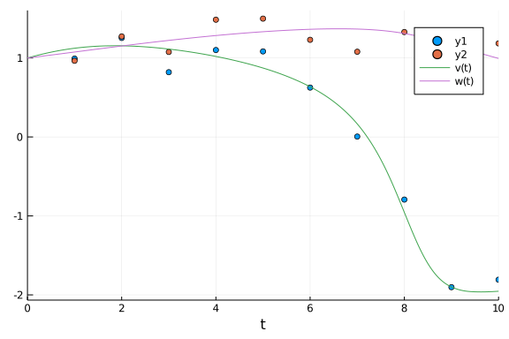

````julia
using DiffEqBayes, BenchmarkTools
````


````julia
using OrdinaryDiffEq, RecursiveArrayTools, Distributions, ParameterizedFunctions, CmdStan, DynamicHMC
using Plots
````


````julia
gr(fmt=:png)
````


````
Plots.GRBackend()
````


### Defining the problem.

The [FitzHugh-Nagumo model](https://en.wikipedia.org/wiki/FitzHugh%E2%80%93Nagumo_model) is a simplified version of [Hodgkin-Huxley model](https://en.wikipedia.org/wiki/Hodgkin%E2%80%93Huxley_model) and is used to describe an excitable system (e.g. neuron).

````julia
fitz = @ode_def FitzhughNagumo begin
  dv = v - v^3/3 -w + l
  dw = τinv*(v +  a - b*w)
end a b τinv l
````


````
(::Main.##WeaveSandBox#355.FitzhughNagumo{Main.##WeaveSandBox#355.var"###Pa
rameterizedDiffEqFunction#375",Main.##WeaveSandBox#355.var"###Parameterized
TGradFunction#376",Main.##WeaveSandBox#355.var"###ParameterizedJacobianFunc
tion#377",Nothing,Nothing,ModelingToolkit.ODESystem}) (generic function wit
h 1 method)
````


````julia
prob_ode_fitzhughnagumo = ODEProblem(fitz,[1.0,1.0],(0.0,10.0),[0.7,0.8,1/12.5,0.5])
sol = solve(prob_ode_fitzhughnagumo, Tsit5())
````


````
retcode: Success
Interpolation: specialized 4th order "free" interpolation
t: 14-element Array{Float64,1}:
  0.0
  0.15079562872319327
  0.6663735500745417
  1.4549121831880751
  2.6341751496828474
  3.7872864628874394
  5.149282290423124
  6.764810407399299
  7.606020974182365
  8.324334146165869
  9.040772814596577
  9.552575705603262
  9.985208121599765
 10.0
u: 14-element Array{Array{Float64,1},1}:
 [1.0, 1.0]
 [1.0242787914016627, 1.0109527801835287]
 [1.0925382825360388, 1.0495725586393927]
 [1.147894455050522, 1.1102123746508352]
 [1.134543873591793, 1.1975474781177977]
 [1.0432761941043434, 1.2718688798460578]
 [0.8446920007269357, 1.3381007267503957]
 [0.3135440377028956, 1.3689380033842313]
 [-0.4098348685955019, 1.342759540998098]
 [-1.4082544459528368, 1.2706202503513042]
 [-1.909783303000839, 1.1563318788556225]
 [-1.9618464536295719, 1.0688710996087507]
 [-1.9544223037206336, 0.9966722929830949]
 [-1.9538629866249133, 0.9942458205399927]
````


Data is genereated by adding noise to the solution obtained above.

````julia
t = collect(range(1,stop=10,length=10))
sig = 0.20
data = convert(Array, VectorOfArray([(sol(t[i]) + sig*randn(2)) for i in 1:length(t)]))
````


````
2×10 Array{Float64,2}:
 0.992127  1.25356  0.8199   1.10043  …  -0.793084  -1.9025   -1.80766
 0.964468  1.27296  1.07612  1.48449      1.32847    1.21824   1.18433
````


### Plot of the data and the solution.

````julia
scatter(t, data[1,:])
scatter!(t, data[2,:])
plot!(sol)
````





### Priors for the parameters which will be passed for the Bayesian Inference

````julia
priors = [truncated(Normal(1.0,0.5),0,1.5),truncated(Normal(1.0,0.5),0,1.5),truncated(Normal(0.0,0.5),0.0,0.5),truncated(Normal(0.5,0.5),0,1)]
````


````
4-element Array{Distributions.Truncated{Distributions.Normal{Float64},Distr
ibutions.Continuous,Float64},1}:
 Truncated(Distributions.Normal{Float64}(μ=1.0, σ=0.5), range=(0.0, 1.5))
 Truncated(Distributions.Normal{Float64}(μ=1.0, σ=0.5), range=(0.0, 1.5))
 Truncated(Distributions.Normal{Float64}(μ=0.0, σ=0.5), range=(0.0, 0.5))
 Truncated(Distributions.Normal{Float64}(μ=0.5, σ=0.5), range=(0.0, 1.0))
````


### Benchmarks

#### Stan.jl backend

````julia
@btime bayesian_result_stan = stan_inference(prob_ode_fitzhughnagumo,t,data,priors;num_samples = 10_000,printsummary=false)
````


````
File /builds/JuliaGPU/DiffEqBenchmarks.jl/tmp/parameter_estimation_model.st
an will be updated.

Error: IOError: chdir : no such file or directory (ENOENT)
````


#### Turing.jl backend

````julia
@btime bayesian_result_turing = turing_inference(prob_ode_fitzhughnagumo,Tsit5(),t,data,priors;num_samples = 10_000)
````


````
26.438 s (244203376 allocations: 17.79 GiB)
Object of type Chains, with data of type 9000×17×1 Array{Float64,3}

Iterations        = 1:9000
Thinning interval = 1
Chains            = 1
Samples per chain = 9000
internals         = acceptance_rate, hamiltonian_energy, hamiltonian_energy
_error, is_accept, log_density, lp, max_hamiltonian_energy_error, n_steps, 
nom_step_size, numerical_error, step_size, tree_depth
parameters        = theta[1], theta[2], theta[3], theta[4], σ[1]

2-element Array{MCMCChains.ChainDataFrame,1}

Summary Statistics
  parameters    mean     std  naive_se    mcse        ess   r_hat
  ──────────  ──────  ──────  ────────  ──────  ─────────  ──────
    theta[1]  0.9691  0.3165    0.0033  0.0044  4125.9162  0.9999
    theta[2]  0.9112  0.2977    0.0031  0.0046  3828.3575  0.9999
    theta[3]  0.0746  0.0342    0.0004  0.0007  2462.0543  0.9999
    theta[4]  0.4995  0.0756    0.0008  0.0016  2233.8494  0.9999
        σ[1]  0.2651  0.0539    0.0006  0.0009  3404.5645  0.9999

Quantiles
  parameters    2.5%   25.0%   50.0%   75.0%   97.5%
  ──────────  ──────  ──────  ──────  ──────  ──────
    theta[1]  0.2784  0.7590  1.0054  1.2193  1.4585
    theta[2]  0.2765  0.7103  0.9309  1.1333  1.4198
    theta[3]  0.0231  0.0501  0.0696  0.0934  0.1558
    theta[4]  0.3736  0.4480  0.4922  0.5426  0.6658
        σ[1]  0.1819  0.2271  0.2576  0.2949  0.3919
````


# Conclusion

FitzHugh-Ngumo is a standard problem for parameter estimation studies. In the FitzHugh-Nagumo model the parameters to be estimated were `[0.7,0.8,0.08,0.5]`. 
`dynamichmc_inference` has issues with the model and hence was excluded from this benchmark.

````julia
using DiffEqBenchmarks
DiffEqBenchmarks.bench_footer(WEAVE_ARGS[:folder],WEAVE_ARGS[:file])
````


## Appendix

These benchmarks are a part of the DiffEqBenchmarks.jl repository, found at: [https://github.com/JuliaDiffEq/DiffEqBenchmarks.jl](https://github.com/JuliaDiffEq/DiffEqBenchmarks.jl)

To locally run this tutorial, do the following commands:

```
using DiffEqBenchmarks
DiffEqBenchmarks.weave_file("ParameterEstimation","DiffEqBayesFitzHughNagumo.jmd")
```

Computer Information:

```
Julia Version 1.4.2
Commit 44fa15b150* (2020-05-23 18:35 UTC)
Platform Info:
  OS: Linux (x86_64-pc-linux-gnu)
  CPU: Intel(R) Core(TM) i7-9700K CPU @ 3.60GHz
  WORD_SIZE: 64
  LIBM: libopenlibm
  LLVM: libLLVM-8.0.1 (ORCJIT, skylake)
Environment:
  JULIA_DEPOT_PATH = /builds/JuliaGPU/DiffEqBenchmarks.jl/.julia
  JULIA_CUDA_MEMORY_LIMIT = 2147483648
  JULIA_PROJECT = @.
  JULIA_NUM_THREADS = 8

```

Package Information:

```
Status: `/builds/JuliaGPU/DiffEqBenchmarks.jl/benchmarks/ParameterEstimation/Project.toml`
[6e4b80f9-dd63-53aa-95a3-0cdb28fa8baf] BenchmarkTools 0.5.0
[a134a8b2-14d6-55f6-9291-3336d3ab0209] BlackBoxOptim 0.5.0
[593b3428-ca2f-500c-ae53-031589ec8ddd] CmdStan 6.0.6
[ebbdde9d-f333-5424-9be2-dbf1e9acfb5e] DiffEqBayes 2.16.0
[1130ab10-4a5a-5621-a13d-e4788d82bd4c] DiffEqParamEstim 1.15.0
[ef61062a-5684-51dc-bb67-a0fcdec5c97d] DiffEqUncertainty 1.4.1
[31c24e10-a181-5473-b8eb-7969acd0382f] Distributions 0.23.4
[bbc10e6e-7c05-544b-b16e-64fede858acb] DynamicHMC 2.1.5
[76087f3c-5699-56af-9a33-bf431cd00edd] NLopt 0.6.0
[1dea7af3-3e70-54e6-95c3-0bf5283fa5ed] OrdinaryDiffEq 5.41.0
[65888b18-ceab-5e60-b2b9-181511a3b968] ParameterizedFunctions 5.3.0
[91a5bcdd-55d7-5caf-9e0b-520d859cae80] Plots 1.5.3
[731186ca-8d62-57ce-b412-fbd966d074cd] RecursiveArrayTools 2.5.0
```

